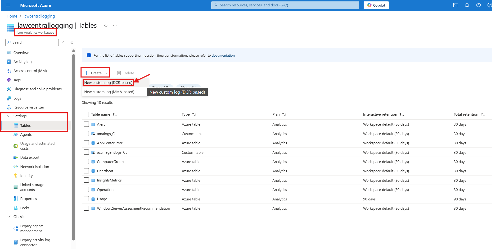
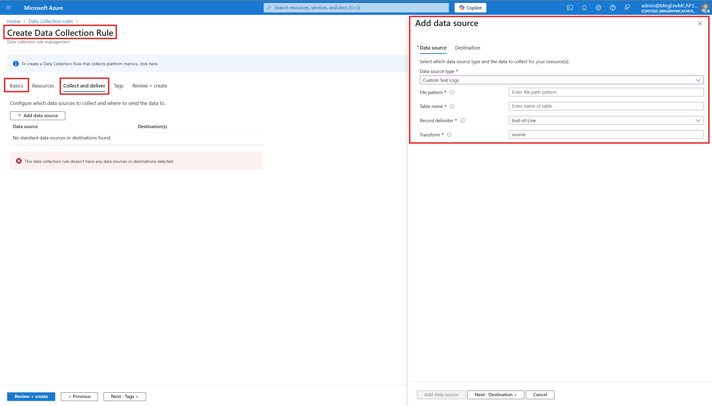
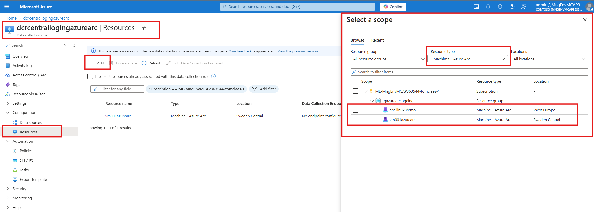

# Centralize Arc Agent Logs with Log Analytics

## Purpose
The purpose of this repository is to provide a guide for setting up centralized logging and monitoring for Azure Arc Connected Machine Agent using a Log Analytics workspace. This approach simplifies troubleshooting, enhances observability, and enables proactive monitoring in hybrid environments.

Previously, users were required to log in to each individual Azure Arc server to fetch the azcmagent.log file. Now, with this solution, the customer can collect all the log files from all the Arc servers it has and query them using a central log analytics workspace.

## Features
- Central logging and monitoring of Azure Arc Connected Machine Agents.
- Utilizes Azure Monitor Agent and custom text logs.
- Supports troubleshooting using Azure Monitor and Log Analytics.
- Enables hybrid cloud visibility and compliance reporting.

## Architecture overview
The solution centralizes logs from on-premises servers into a Log Analytics Workspace. The main components include:
- **Azure Arc Connected Machine Agent**
- **Azure Monitor Extension**
- **Data Collection Rule (DCR)**
- **Data Collection Endpoint (DCE)**
- **Log Analytics Workspace**

This architecture provides a unified view across on-premises and cloud environments, enabling consistent monitoring and diagnostics.


## Prerequisites
- An active Azure subscription.
- A Log Analytics workspace.
- Azure Arc Connected Machine Agent installed on your machines.
- A Data Collection Rule and Data Collection Endpoint configured in Azure.

## Usage

### Step 1: Create a Log Analytics Workspace, Data Collection Rule, and Data Collection Endpoint
- Create a Log Analytics Workspace (you may re-use an existing one).
- Create a Data Collection Endpoint (DCE).

### Step 2: Create a Custom Table in Log Analytics Workspace
- In your Log Analytics Workspace, create a custom table to store the logs. (see picture below)


- Use the following sample JSON to define your schema:

  ```json
  [
    {
      "TimeGenerated": "2025-04-02T12:39:42Z",
      "level": "debug",
      "msg": "Running as elevated user"
    }
  ]
  ```

### Step 3: Create and Configure the Data Collection Rule to Collect Custom Text Files
- Create and configure a DCR (see picture below):



- Fill in the Basics tab first
- In your configs, add a data source for custom text logs:
  - **File pattern**:
    - Windows: `C:\ProgramData\AzureConnectedMachineAgent\Log\azcmagent.log`
    - Linux: `/var/opt/azcmagent/log/azcmagent.log`
  - **Table name**: Use the custom table name from Step 2.
  - **Record delimiter**: End-of-Line
  - **Transform**: Use the following KQL to parse log lines:
    ```kql
    source  | extend TimeGenerated = todatetime(extract(@"time=""([^""]+)""", 1, RawData)),  level = extract(@"level=([^ ]+)", 1, RawData),  msg = extract(@"msg=(.*)", 1, RawData)  | project TimeGenerated, level, msg
    ```
  - **Destination**: Select your Log Analytics Workspace.

  Next: *review and create*.


### Step 4: Associate the Data Collection Rule with Your Arc Server(s)
- Associate the DCR with your Azure Arc-enabled servers.
- When associating, the Azure Monitor Extension will be enabled automatically.

See picture below:



### Step 5: Query Data in Log Analytics Workspace
- After a few minutes, data will be ingested.
- In the Azure Portal, go to your Log Analytics Workspace and select **Logs**.
- Use a KQL query like the following (replace `<YourCustomTableName>`):
  ```kql
  <YourCustomTableName>
  | extend ArcVMid = tostring(split(_ResourceId, "/")[-1])
  | project TimeGenerated, ArcVMid, level, msg
  ```

Once set up, the Log Analytics Workspace interface will look like this:


## Potential Use Cases
- **Proactive Troubleshooting**: Detect and resolve issues before they impact workloads.
- **Compliance & Auditing**: Maintain a consistent log history for compliance reporting.
- **Automation & Alerting**: Set up alerts based on log patterns to reduce manual monitoring.
- **Hybrid Cloud Visibility**: Gain insights across on-premises and cloud environments.
