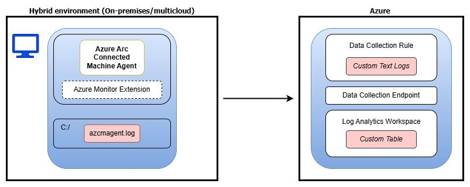
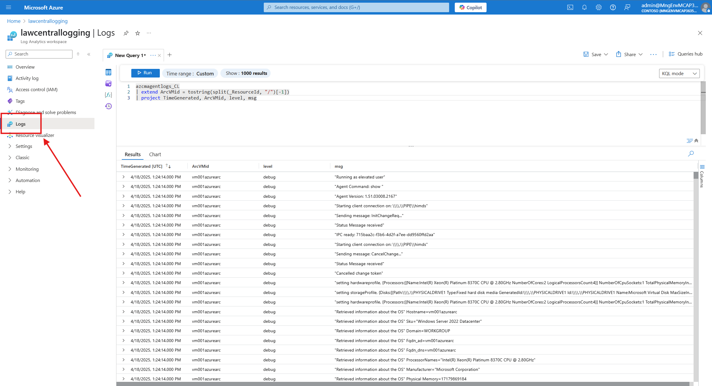

# Centralize Arc Agent Logs with Log Analytics

## About
This repository explains how you can transfer the Azure Arc Connected Machine Agent logs to a Log Analytics workspace to allow for central logging and monitoring of the different agents. It also mentions the use of the Azure Monitor Agent, custom text logs, and troubleshooting techniques.

## Purpose
The purpose of this repository is to provide a guide for setting up centralized logging and monitoring for Azure Arc Connected Machine Agent using a Log Analytics workspace. This approach simplifies troubleshooting, enhances observability, and enables proactive monitoring in hybrid environments.

Previously, users were required to log in to each individual Azure Arc server to fetch the azcmagent.log file. Now, with this solution, the customer can collect all the log files from all the Arc servers it has and query them using a central log analytics workspace.

## Features
- Central logging and monitoring of Azure Arc Connected Machine Agents.
- Utilizes Azure Monitor Agent and custom text logs.
- Supports troubleshooting using Azure Monitor and Log Analytics.
- Enables hybrid cloud visibility and compliance reporting.

## Architecture Overview
The solution centralizes logs from on-premises servers into a Log Analytics Workspace. The main components include:
- **Azure Arc Connected Machine Agent**
- **Azure Monitor Extension**
- **Data Collection Rule (DCR)**
- **Data Collection Endpoint (DCE)**
- **Log Analytics Workspace**

This architecture provides a unified view across on-premises and cloud environments, enabling consistent monitoring and diagnostics.

## Getting Started
To get started, follow the instructions below to set up the Azure Arc Connected Machine Agent and configure it to send logs to a Log Analytics workspace.

## Prerequisites
- An active Azure subscription.
- A Log Analytics workspace.
- Azure Arc Connected Machine Agent installed on your machines.
- A Data Collection Rule and Data Collection Endpoint configured in Azure.

## Usage 

Please refer to following Microsoft Tech Community article I wrote, that will clearly explain the different steps: [link to the article](https://techcommunity.microsoft.com/blog/azurearcblog/troubleshoot-the-azure-arc-agent-in-azure-using-azure-monitor--log-analytics-wor/4411895).

Once set up, the Log Analytics Workspace interface will look like this:

## Potential Use Cases
- **Proactive Troubleshooting**: Detect and resolve issues before they impact workloads.
- **Compliance & Auditing**: Maintain a consistent log history for compliance reporting.
- **Automation & Alerting**: Set up alerts based on log patterns to reduce manual monitoring.
- **Hybrid Cloud Visibility**: Gain insights across on-premises and cloud environments.

## Conclusion
Centralizing logs from on-premises servers into a Log Analytics Workspace using Azure Arc and the Azure Monitor Agent simplifies operations, enhances observability, and lays the foundation for advanced analytics and automation.
